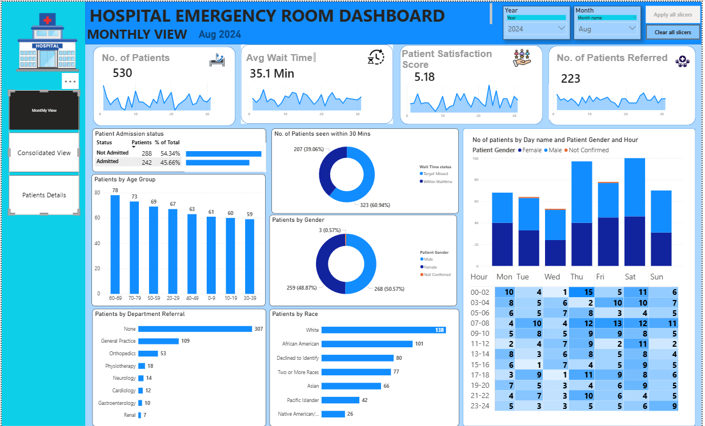
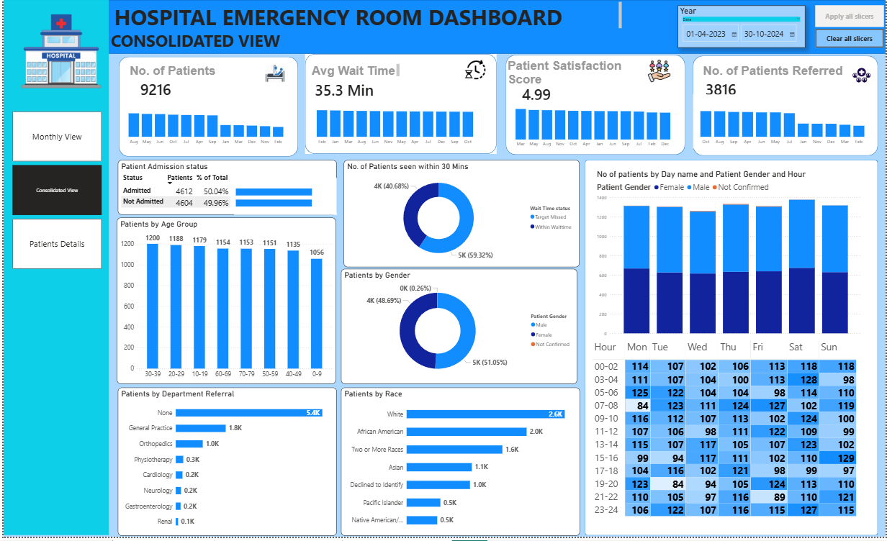
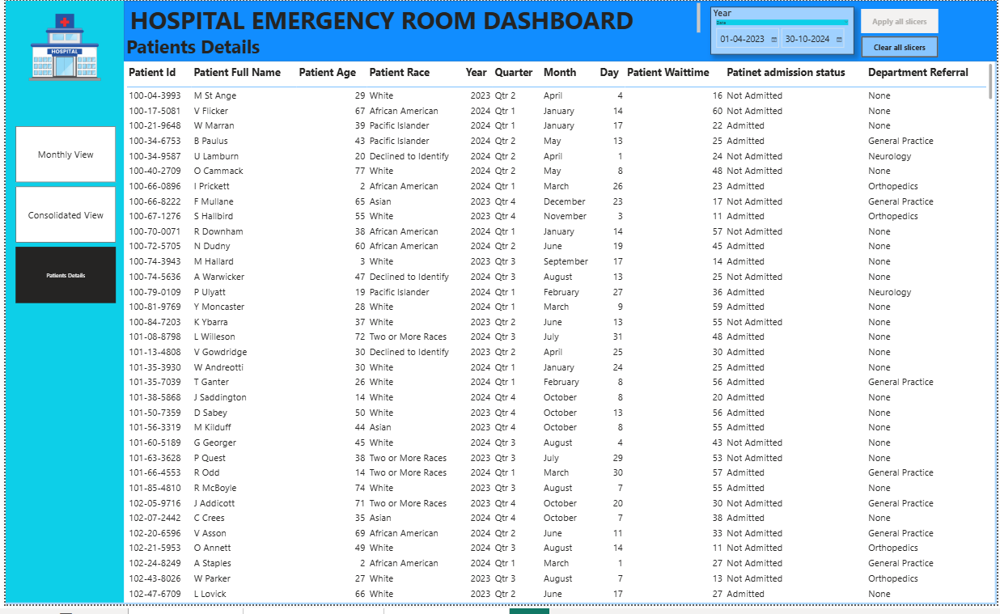

# Hospital-ER-Dashboard-

# 🏥 Hospital Emergency Room Dashboard | Power BI

## 📌 Project Overview

The **Hospital Emergency Room Dashboard** is an interactive Business Intelligence solution developed in **Power BI** to monitor Emergency Room (ER) operations and patient flow. The dashboard enables healthcare administrators to analyze patient admissions, waiting times, satisfaction scores, referrals, and demographic trends through dynamic visualizations.

The report consists of **three interactive pages**:

- 📊 Monthly View
- 📈 Consolidated View
- 👨‍⚕️ Patient Details

---

# 🎯 Business Problem

Hospitals generate thousands of patient records every month, making it difficult to monitor operational performance using spreadsheets.

This dashboard helps answer important business questions such as:

- How many patients visited the ER?
- What is the average patient waiting time?
- How many patients were admitted?
- Which departments receive the most referrals?
- Which age groups visit the hospital most frequently?
- What are the busiest days and hours?
- How satisfied are patients with the services?

---

# 🛠️ Tools & Technologies

- Power BI Desktop
- Power Query
- DAX
- Excel
- Data Modeling
- Data Visualization

---

# 📂 Dataset

The dataset contains Emergency Room patient records including:

- Patient ID
- Patient Name
- Admission Date
- Age
- Gender
- Race
- Department Referral
- Waiting Time
- Admission Status
- Satisfaction Score

---

# 📈 Dashboard Pages

## 1️⃣ Monthly View

Provides month-level analysis of hospital performance.

### KPIs

- Total Patients
- Average Waiting Time
- Patient Satisfaction Score
- Patients Referred

### Visualizations

- Patient Admission Status
- Age Group Distribution
- Patients Seen Within 30 Minutes
- Gender Distribution
- Department Referrals
- Race Distribution
- Day & Hour Heatmap

---

## 2️⃣ Consolidated View

Provides overall hospital performance across all available months.

### Includes

- Overall KPIs
- Monthly Trends
- Patient Demographics
- Department Analysis
- Waiting Time Analysis
- Referral Analysis
- Operational Heatmap

---

## 3️⃣ Patient Details

A detailed patient-level report that allows users to drill into individual records.

Includes:

- Patient ID
- Patient Name
- Age
- Race
- Waiting Time
- Admission Status
- Department Referral
- Date Information

---

# 📊 Key KPIs

- 👥 Total Patients
- ⏳ Average Waiting Time
- 😊 Patient Satisfaction Score
- 🏥 Patients Referred
- 🚑 Admission Status
- 👨 Male vs Female Patients
- ⌛ Patients Seen Within 30 Minutes

---

# 📌 Features

✔ Interactive Filters

- Year
- Month

✔ Navigation Buttons

- Monthly View
- Consolidated View
- Patient Details

✔ Dynamic KPI Cards

✔ Drill-through Analysis

✔ Interactive Charts

✔ Heatmap for Hourly Patient Traffic

✔ Responsive Dashboard Layout

---

# 📈 Key Business Insights

- Approximately half of the patients are admitted while the remaining are discharged.
- Most patients are attended within the target waiting time.
- The majority of referrals come from General Practice.
- Adult patients account for the largest proportion of ER visits.
- Patient traffic varies significantly by weekday and hour, helping identify peak operating periods.
- Average patient waiting time remains around 35 minutes.
- Patient satisfaction remains consistently high.

---

# 💡 Business Recommendations

- Increase staffing during peak hours identified in the heatmap.
- Improve resource allocation in highly referred departments.
- Monitor waiting time trends to improve patient satisfaction.
- Continue tracking admission rates to optimize bed availability.
- Use demographic insights for better healthcare planning.

---

# 🧮 DAX Measures Used

Examples include:

- Total Patients
- Average Waiting Time
- Patient Satisfaction Score
- Admission Status
- Patients Referred
- Patients Seen Within 30 Minutes

---

# 🧹 Data Preparation

Data transformation was performed using Power Query, including:

- Data type corrections
- Null value handling
- Date formatting
- Custom column creation
- Data cleaning

---

# 📸 Dashboard Preview

## 📅 Monthly View



---

## 📊 Consolidated View



---

## 👨‍⚕️ Patient Details


---

# 📁 Repository Structure

```
Hospital-ER-Dashboard/
│
├── Dashboard.pbix
├── Hospital_ER_Data.xlsx
├── README.md
├── Images/
│   ├── Monthly_View.png
│   ├── Consolidated_View.png
│   └── Patient_Details.png
```

---

# 🚀 Skills Demonstrated

- Power BI
- Power Query
- DAX
- Data Modeling
- Dashboard Design
- Data Visualization
- Business Intelligence
- Data Analysis
- KPI Reporting
- Interactive Reporting

---

# 👨‍💻 Author

**Nitin Agarwal**

📧 Email: nitingwl25@gmail.com

🔗 LinkedIn: https://www.linkedin.com/in/nitinagarwal25/

💻 GitHub: https://github.com/nitingwl25

---

## ⭐ If you found this project helpful, please consider giving it a star!
